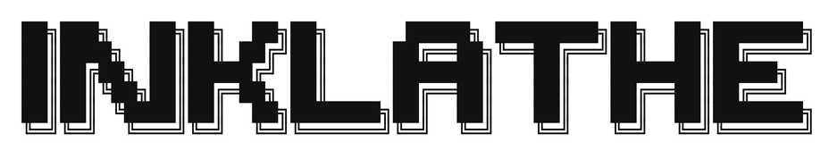
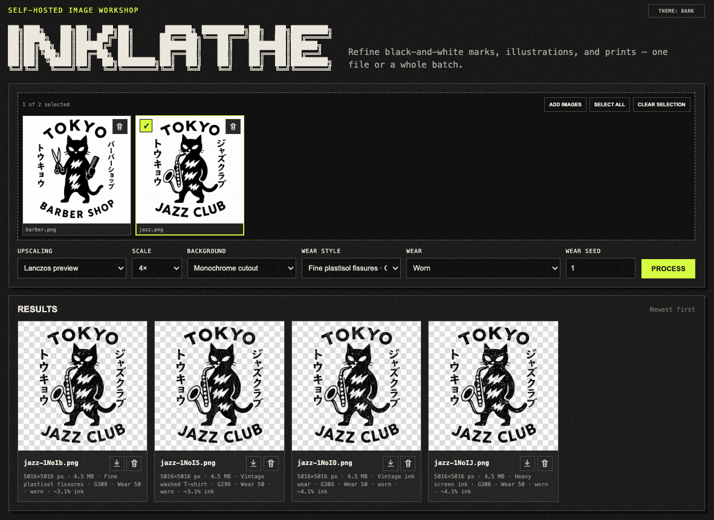

# InkLathe



`restore / isolate / upscale / distress`

InkLathe is a self-hosted image workshop for preparing black-and-white logos,
illustrations, and print artwork. The built-in workflow runs locally. Optional AI
workers can be installed separately on the same server.



## Current features

- Process one image or a selected batch from a five-image source tray
- Use built-in Lanczos scaling or an optional external AI upscaler
- Keep the source background, make a monochrome cutout, or use optional Lucida AI
- Screen isolated ink through scanned halftone or engraved patterns
- Apply licensed, locally installed wear masks at four fixed levels
- Choose a predictable mask placement: Centered, Mirrored, or Offset crop
- Alt-click Process to randomize print treatment, wear style, wear level, and placement
- Save complete processing combinations as browser-local favorites
- Preview results full-size, zoom and pan, and compare through an original-image lens
- Navigate previews with buttons or the left and right arrow keys
- Download or delete individual PNG results
- Alt-click a delete control to skip its confirmation
- Reuse cached normalization, scaling, background, and print-treatment stages
- Queue additional Process or Alt-Process runs while the single image worker is busy
- Keep storage below a configurable ceiling by evicting cache files before old jobs
- Name downloads with sortable five-character Base62 run stamps

## Processing order

InkLathe always runs the selected stages in this order:

1. Normalize the uploaded image.
2. Upscale it.
3. Remove or retain its background.
4. Apply the optional Print treatment.
5. Apply the optional Wear style and level.

The built-in and external choices are deliberately separate:

| Control | Choice | Implementation |
| --- | --- | --- |
| Upscaling | None | Leaves the dimensions unchanged |
| Upscaling | Lanczos preview | Built into InkLathe through Pillow |
| Upscaling | AI model | Calls an administrator-configured external command |
| Background | Keep original | Leaves the image background unchanged |
| Background | Monochrome cutout | Built-in Otsu-based light-background removal |
| Background | Lucida AI | Calls a separately installed Lucida CLI and model |

## Quick start

InkLathe requires Python 3.12 or newer.

```bash
python3 -m venv .venv
.venv/bin/pip install -e '.[dev]'
INKLATHE_DATA_DIR=./data .venv/bin/inklathe
```

Open <http://127.0.0.1:8787>.

The normal installation does **not** install Lucida, an AI upscaler, PyTorch, model
weights, or GPU drivers. Without external workers, use `Lanczos preview` and
`Monochrome cutout`; both are fully functional local implementations.

## Optional AI workers

InkLathe runs optional workers as child processes. Configure commands with environment
variables before starting InkLathe. Use absolute paths when running it as a service.

The interface reports an option as `configured` when its environment variable is set.
This is not a live model-health check: an invalid executable or missing weight file is
reported when a job tries to use it.

Open `AI setup` in the web interface to see the current configuration and recheck it
after a server rebuild. For safety, the page cannot install packages or change executable
paths: those operations remain part of the administrator-controlled NixOS configuration.
The dialog can copy matching install and uninstall configuration. The uninstall version
disconnects optional AI workers but deliberately leaves InkLathe uploads, results, masks,
favorites, and application files untouched. Externally installed model directories should
only be removed separately after their actual server paths have been verified.

### Background removal: Lucida

[`egeorcun/lucida`](https://github.com/egeorcun/lucida) is a BiRefNet-based background
remover designed to preserve details such as text, line art, glow, and print designs.
Its code and model are not part of InkLathe.

Install Lucida in its own environment, following its upstream instructions. One
possible layout is:

```bash
git clone https://github.com/egeorcun/lucida /opt/lucida
python3.12 -m venv /opt/lucida/.venv
/opt/lucida/.venv/bin/pip install -e /opt/lucida
```

Download the released weights from
[`egeorcun/lucida` on Hugging Face](https://huggingface.co/egeorcun/lucida) and put
them at the path required by that Lucida release. Verify the installation independently:

```bash
/opt/lucida/.venv/bin/bgr remove input.png -o output.png --model lucida
```

Then configure only the base CLI command. InkLathe appends
`remove INPUT -o OUTPUT --model lucida` itself:

```bash
export INKLATHE_LUCIDA_COMMAND=/opt/lucida/.venv/bin/bgr
INKLATHE_DATA_DIR=./data .venv/bin/inklathe
```

The worker must produce a transparent RGBA PNG at the requested output path. Lucida's
official CLI does this directly.

### Upscaling: command adapter

`AI model` currently means **any external command that follows InkLathe's adapter
contract**. InkLathe invokes it as:

```text
COMMAND INPUT_PATH OUTPUT_PATH SCALE
```

`SCALE` is `2` or `4`. The command must exit successfully and write a PNG to the exact
`OUTPUT_PATH`. InkLathe does not currently bundle or require UCAN. UCAN remains a
research candidate, but there is no UCAN-specific adapter in this repository.

For a practical installation, the repository includes
[`scripts/realesrgan_adapter.sh`](scripts/realesrgan_adapter.sh), which translates the
contract to the official
[`realesrgan-ncnn-vulkan`](https://github.com/xinntao/Real-ESRGAN) command-line syntax.
Install that executable and its model files separately, then configure:

```bash
chmod +x scripts/realesrgan_adapter.sh
export INKLATHE_REALESRGAN_BIN=/opt/realesrgan/realesrgan-ncnn-vulkan
export INKLATHE_REALESRGAN_MODEL_DIR=/opt/realesrgan/models
export INKLATHE_REALESRGAN_MODEL=realesrgan-x4plus
export INKLATHE_AI_UPSCALER_COMMAND=/absolute/path/to/inklathe/scripts/realesrgan_adapter.sh
INKLATHE_DATA_DIR=./data .venv/bin/inklathe
```

Test the adapter before starting the service:

```bash
scripts/realesrgan_adapter.sh input.png /tmp/inklathe-upscaled.png 4
```

AI upscalers may invent or soften details in hard-edged logos. Compare them with the
built-in Lanczos result before using an output for print.

## Configuration

| Environment variable | Default | Purpose |
| --- | --- | --- |
| `INKLATHE_HOST` | `127.0.0.1` | HTTP bind address |
| `INKLATHE_PORT` | `8787` | HTTP port |
| `INKLATHE_DATA_DIR` | `./data` | Jobs, previews, archives, cache, and default texture directory |
| `INKLATHE_TEXTURE_DIR` | `$INKLATHE_DATA_DIR/textures` | Optional private mask directory |
| `INKLATHE_MAX_UPLOAD_BYTES` | `26214400` | Per-file upload limit |
| `INKLATHE_MAX_PIXELS` | `40000000` | Maximum decoded source-image pixels |
| `INKLATHE_MAX_DATA_GB` | `20` | Storage ceiling; use `0` to disable cleanup |
| `INKLATHE_AUTH_USERNAME` | `inklathe` | HTTP Basic authentication username |
| `INKLATHE_AUTH_PASSWORD_FILE` | unset | Preferred path to a password-only credential file |
| `INKLATHE_AUTH_PASSWORD` | unset | Direct password fallback; avoid it in production |
| `INKLATHE_LUCIDA_COMMAND` | unset | Base Lucida CLI command |
| `INKLATHE_AI_UPSCALER_COMMAND` | unset | Upscaler command following the three-argument contract |

When the storage ceiling is reached, InkLathe cleans down to 90%, removing
least-recently-used cache files before completed job directories. Current and queued
jobs are protected.

The server currently uses one worker thread. This avoids loading multiple large models
at once on the intended single-user server.

## NixOS deployment

The repository provides a Nix package and NixOS module through `flake.nix`. The module:

- runs InkLathe as an unprivileged `inklathe` system user;
- keeps runtime data in `/var/lib/inklathe`;
- binds the application only to `127.0.0.1:18787` by default;
- loads the password with a systemd credential instead of the Nix store;
- adds a Caddy HTTPS reverse proxy; and
- opens only ports 80 and 443.

First create a root-readable password file containing only the chosen password:

```bash
sudo install -d -m 0700 /var/lib/secrets
sudoedit /var/lib/secrets/inklathe-auth-password
sudo chmod 0400 /var/lib/secrets/inklathe-auth-password
```

Add the local checkout as an input to the server's existing NixOS flake:

```nix
inputs.inklathe = {
  url = "path:/etc/nixos/vendor/inklathe";
  inputs.nixpkgs.follows = "nixpkgs";
};
```

Then include and configure its module in the server's `nixosSystem.modules` list:

```nix
modules = [
  inputs.inklathe.nixosModules.default
  {
    services.inklathe = {
      enable = true;
      domain = "inklathe.zerolabs.se";
      port = 18787;
      authUsername = "inklathe";
      authPasswordFile = "/var/lib/secrets/inklathe-auth-password";
      maxDataGB = 20;

      # Optional background-removal worker:
      # lucidaCommand = "/opt/lucida/.venv/bin/bgr";

      # Optional generic upscaler using COMMAND INPUT OUTPUT SCALE:
      # aiUpscalerCommand = "/opt/inklathe/upscale-adapter";

      # Or use the Real-ESRGAN adapter included in the Nix package:
      # realEsrganBinary = "/opt/realesrgan/realesrgan-ncnn-vulkan";
      # realEsrganModelDir = "/opt/realesrgan/models";
      # realEsrganModel = "realesrgan-x4plus";
    };
  }
];
```

The exact location depends on the existing flake's `outputs` structure. After adding
it, apply and verify the configuration:

```bash
sudo nixos-rebuild test --flake /etc/nixos#SERVER
sudo nixos-rebuild switch --flake /etc/nixos#SERVER
systemctl status inklathe
curl -u inklathe https://inklathe.zerolabs.se/api/health
```

The DNS A record for `inklathe.zerolabs.se` must point to the server, and inbound TCP
80/443 must reach Caddy. Caddy obtains and renews the TLS certificate automatically.
Never expose the configured internal application port through the router or public
firewall. Only ports 80 and 443 should reach Caddy.

Install licensed texture files separately under
`/var/lib/inklathe/textures/{wear,halftone}/`; they are deliberately absent from the
Nix package and Git repository.

## Job queue

`Process` and Alt-click `Process` may be used again as soon as the upload has been
accepted, even while earlier runs are queued or processing. Every click keeps its own
settings snapshot, progress cards, and error state. The server processes submitted runs
in FIFO order with one image worker, which avoids loading multiple large models at once.
Changing the controls after submitting a run does not change that queued run.

## Local print masks

InkLathe can use high-resolution grayscale texture scans without redistributing them.
Place licensed copies in `$INKLATHE_DATA_DIR/textures` or set
`INKLATHE_TEXTURE_DIR` to another private directory.

The recommended library layout is:

```text
textures/
├── textures.json
├── wear/
│   └── your-wear-mask.jpg
└── halftone/
    └── your-print-pattern.jpg
```

`textures.json` is the library catalog and the only place where menu names and mask
behavior are configured. For example:

```json
{
  "version": 1,
  "textures": [
    {
      "id": "my-crackle",
      "type": "wear",
      "file": "wear/my-crackle.jpg",
      "name": "Dry ink crackle",
      "category": "Screen print",
      "maximum": 0.12
    },
    {
      "id": "my-dots",
      "type": "halftone",
      "file": "halftone/my-dots.jpg",
      "name": "Coarse printed dots",
      "category": "Halftone",
      "invert": true
    }
  ]
}
```

- `id` is a stable internal identifier using lowercase letters, numbers, and hyphens.
- `name` is the English label shown in the dropdown.
- `category` creates the dropdown group.
- `file` is a path relative to the texture directory.
- `maximum` limits how much ink a Wear mask can remove at the strongest level.
- `invert` reverses the light/dark interpretation of a Print treatment mask.

InkLathe ships a default catalog for its known masks. A local `textures.json` replaces
that catalog, so it can add, remove, rename, and reorganize treatments without a Python
code change. Missing image files are omitted from the menus. Invalid JSON, duplicate
IDs, unsafe paths, or invalid field values stop startup with a descriptive error. The
server must be restarted after catalog changes. Legacy installations with known images
directly inside `textures/` continue to work.

Dark marks in these scans become transparent ink knockouts. InkLathe uses a single
large, non-tiled crop. Pattern placement has three fixed, reproducible choices:
Centered, Mirrored, and Offset crop.

These masks screen isolated ink into binary printable dots or engraved lines before
the selected wear is applied. Copying an arbitrary new JPG into the directory is not
enough by itself; add a matching entry to the local catalog.

Do not commit third-party texture files unless their license explicitly permits
redistribution as part of an image-processing application.

See [THIRD_PARTY_ASSETS.md](THIRD_PARTY_ASSETS.md) before adding assets or changing
the repository from private to public. Repository privacy is not a substitute for a
redistribution license.

## Favorites, results, and persistence

Favorites contain the complete current processing combination, including Pattern
placement. They are stored in the browser's local storage for this exact site origin.
They survive a normal page reload but do not automatically move to another browser,
hostname, or port.

Uploaded sources, generated results, previews, archives, and cache files are stored on
disk under `INKLATHE_DATA_DIR`. The current result gallery and in-memory job index are
not restored after a page reload or server restart yet. Existing files remain on disk
until storage cleanup removes their job directory, but the current UI has no disk
history browser for reopening them.

Downloads keep the original safe filename stem and append
an always-five-character Base62 run stamp seeded from the number of seconds since
2026-01-01 UTC when each individual image finishes. For example: `logo-00A1z.png`.
Processing uses private temporary names, so failed work is never assigned a finished
download name. If several images finish within the same second, the server advances the
stamp by one for each image. This keeps names unique and sortable, although rapid cache
hits can make the logical stamp run slightly ahead of wall-clock time.

## Development

Run the checks with:

```bash
.venv/bin/ruff check src tests scripts
.venv/bin/pytest -q
bash -n scripts/realesrgan_adapter.sh
```

The next server milestones are persistent job-history indexing, authentication and
reverse-proxy guidance, and reproducible NixOS packaging for InkLathe plus its optional
workers.

## License

To be decided before the first public release.
